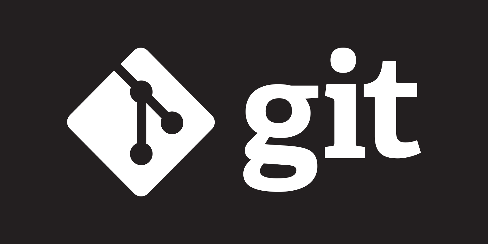
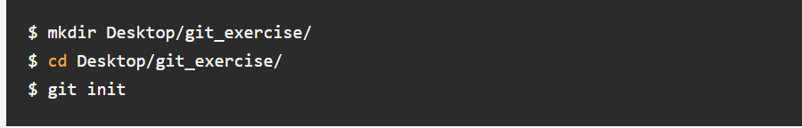
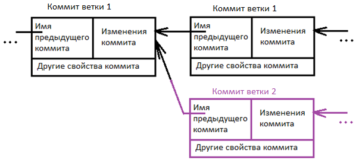

# Работа с Git

## 1.Проверка наличия установленного Git

В терминале выполнить команду 
`git version`
Если Git установлен, появятся сообщения с информацией о  версии программы. Иначе будет сообщение о ошибке. 

## 2. Установка Git
Загружаем последнюю версию Git с [сайта](https://git-scm.com/book/ru/v2/Введение-Установка-Git)

## 3. Настройка Git
При первом использовании Git необходимо представиться. Для этого нужно в терминале ввести две команды
```
git config --global user.name "My Name"
git config --global user.email myEmail@example.com
```
## 4.Создание нового Репозитория и инициализация

После Настройки нам нужно открыть терминал, зайти в папку нашего проекта и выполнить команду init. Это включит приложение в этой конкретной папке и создаст скрытую директорию .git, где будет храниться история репозитория и настройки.
Создайте на рабочем столе папку под названием One.Для этого в окне терминала введите:



После ввода команды git init программа должна выдать вам на экране:

```
Initialized empty Git repository in /home/user/Desktop/git_exercise/.git/
```
Это значит, что наш репозиторий был успешно создан, но пока что пуст.

## 5 Определение  состояния

status — это еще одна важнейшая команда, которая показывает информацию о текущем состоянии репозитория: актуальна ли информация на нём, нет ли чего-то нового, что поменялось, и так далее. Запуск git status на нашем свежесозданном репозитории должен выдать:

```
$ git status
On branch master
Initial commit
Untracked files:
(use "git add ..." to include in what will be committed)
instuction.md

```

Сообщение говорит о том, что файл instuction.md неотслеживаемый. Это значит, что файл новый и система еще не знает, нужно ли следить за изменениями в файле или его можно просто игнорировать. Для того, чтобы начать отслеживать новый файл, нужно его специальным образом объявить.

## 6 Подготовка файлов
В git есть концепция области подготовленных файлов. Можно представить ее как холст, на который наносят изменения, которые нужны в коммите. Сперва он пустой, но затем мы добавляем на него файлы (или части файлов, или даже одиночные строчки) командой add и, наконец, коммитим все нужное в репозиторий (создаем слепок нужного нам состояния) командой commit.
В нашем случае у нас только один файл, так что добавим его:
```
$ git add instruction.md
```

Если нам нужно добавить все, что находится в директории, мы можем использовать

````
$ git add -A
````

## 7 Commit(фиксация изменений)
Коммит представляет собой состояние репозитория в определенный момент времени. Это похоже на снапшот, к которому мы можем вернуться и увидеть состояние объектов на определенный момент времени.
Чтобы зафиксировать изменения, нам нужно хотя бы одно изменение в области подготовки (мы только что создали его при помощи git add), после которого мы может коммитить:

```
$ git commit -m "Initial commit."
```
Эта команда создаст новый коммит со всеми изменениями из области подготовки (добавление файла instructiom.md). Ключ -m и сообщение «Initial commit.» — это созданное пользователем описание всех изменений, включенных в коммит. Считается хорошей практикой делать коммиты часто и всегда писать содержательные комментарии.

Чтобы создать новую ветку, нужно использовать команду git checkout с флагом -b и указанием имени ветки. Таким образом вы создадите ответвление той ветки, в которой находитесь. История новой ветки начнется с момента ответвления.

Если нужно перейти в уже существующую ветку, используйте ту же команду git checkout, но без добавления флага -b. Команде нужно передать имя ветки, в которую вы хотите перейти.

Для перехода в предыдущую ветку (т. е. ту, из которой вы перешли в текущую) можно передать команде git checkout не имя ветки, а просто дефис.

Чтобы перейти к определенному коммиту, используйте ту же команду git checkout, но вместо имени ветки передайте ей SHA коммита.

Ветки по сути являются просто указателями трекерами отдельных коммитов в истории Git

## 8.Git Diff

Для вывода изменений в файлах по сравнению с последним коммитом, используется git diff без параметров:
```
git diff

```
Команда выводит изменения в файлах, которые еще не были добавлены в индекс. Сравнение происходит с последним коммитом.

## 9. Git log

Позволяет смотреть историю изменений Commit и смотреть что с репозиториями происходит


## Игнорирование файлов

Игнорируемые файлы — это, как правило, артефакты сборки и файлы, генерируемые машиной из исходных файлов в вашем репозитории, либо файлы, которые по какой-либо иной причине не должны попадать в коммиты. Вот некоторые распространенные примеры таких файлов:

кэши зависимостей, например содержимое /node_modules или /packages;
скомпилированный код, например файлы .o, .pyc и .class ;
каталоги для выходных данных сборки, например /bin, /out или /target;
файлы, сгенерированные во время выполнения, например .log, .lock или .tmp;
скрытые системные файлы, например .DS_Store или Thumbs.db;
личные файлы конфигурации IDE, например .idea/workspace.xml.
Игнорируемые файлы отслеживаются в специальном файле .gitignore, который регистрируется в корневом каталоге репозитория. В Git нет специальной команды для указания игнорируемых файлов: вместо этого необходимо вручную отредактировать файл .gitignore, чтобы указать в нем новые файлы, которые должны быть проигнорированы. Файлы .gitignore содержат шаблоны, которые сопоставляются с именами файлов в репозитории для определения необходимости игнорировать эти файлы.


## Информация о работе с ветками

Ветка в Git это подвижный указатель на один из коммитов. Обычно ветка указывает на последний коммит в цепочке коммитов. Ветка берет свое начало от какого-то одного коммита. Визуально это можно представить вот так.


r

Сделать новую ветку и переключиться на нее можно выполнив команды
```
git pull
git checkout –b <имя новой ветки>
```

Просто сделать ветку, не переключаясь на нее можно командой
```
git branch <имя ветки>
```
переключиться на ветку
````
git checkout <имя ветки>
````
Важно понимать, что ветка берет свое начало не от ветки, а от последнего коммита который находиться в той ветке, в которой вы находились.

Ветка обычно заканчивается специальным merge коммитом, который говорит, что ветку нужно объединить с какой-то другой веткой. В merge коммите содержатся две ссылки на два коммита которые объединяются в одну ветку.


Существует другая ситуация при объединении веток, в которой merge может произойти без merge commit. Дело в том, что если в одной из веток не произошло никаких изменений, то необходимость в merge commit с двумя предками отпадает. В таком случае, при слиянии веток, Git просто сделает пометку о том, что дальше будут идти коммиты той ветки с которой эта ветка была объединена. 

Во всех этих случаях, после того, как ветка объединяется с другой веткой, все коммиты сделанные в ней, попадают в ветку с которой она была объединена. Так же важно понимать, что merge это не двунаправленная операция. Если смержить ветку задачи в мастер ветку, то в мастер ветке появится код, который находился в ветке задачи, а в ветке задачи не появиться новый код из мастер ветки. Если нужно что бы это произошло, нужно смержить мастер ветку в ветку задачи.
Что бы смержить одну ветку в другую нужно вначале переключиться на ту ветку, в которую вы хотите смержить
```
git checkout <имя ветки>
```
Потом получить последние изменения сделанные в этой ветке выполнив
```
git pull
```
Затем выполнить команду
```
git merge <имя ветки>
```
Так выглядит работа с ветками в общих чертах.


Теперь можно описать популярные схемы работы с ветками в гите.

Ветки нужны для того, чтобы программисты могли вести совместную работу над проектом и не мешать друг другу при этом. При создании проекта, Git создает базовую ветку. Она называется master веткой. Она считается центральной веткой, т.е. в ней содержится основной код приложения.

Классическая схема работы с ветками

Обычно перед тем как взяться за решение какой-то задачи, программист заводит новую ветку от последнего рабочего коммита мастер ветки и решает задачу в этой новой ветке. В ходе решения он делает ряд коммитов, после этого тестирует код непосредственно в ветке задачи. А после того как задача решена, делают merge обратно в мастер ветку. Такую схему работы часто используют с юнит тестами и автоматизированным деплоем. Если юнит тесты будут покрывать весь код, то можно настроить деплой так, что вначале будут прогоняться все тесты в ветке задачи. А после этого, если они прошли успешно, будет происходить merge и деплой. При такой схеме можно добиться полной автоматизации при тестировании и деплои.

Именная ветка

Неопытные программисты заводят себе именную ветку и работают всегда в ней. Они решают по одной задачи за раз, и когда заканчивают решение одной из задач, делают новый Pull запрос через Web интерфейсе (об этом чуть ниже). Недостаток этого подхода в том, что так можно решать только одну задачу и нельзя быстро переключиться на решение другой задачи. Еще один недостаток в том, что ветки так со временем будут все сильнее расходиться и код в ветке программиста рано или поздно устареет относительно мастер ветки и его придется обновить. Для этого можно либо смержить мастер ветку в ветку программиста, либо завести новую ветку для этого программиста от последнего рабочего состояния в мастер ветке. Правда к тому времени, как это произойдет программист уже может освоить гит в достаточной мере что бы перейти на “классическую” схему работы. Таким образом эта схема имеет место быть для неопытных пользователей Git.

Схема с dev веткой

Другая схема очень похожа на классическую, только в ней помимо мастер ветки есть еще девелоперская ветка, которая деплоится на тестовый сервер. Такую ветку обычно называют dev. Схема работы при этом такая. Программист перед выполнением новой задачи заводит для нее ветку от последнего рабочего состояния в мастер ветке. Когда он заканчивает работу над задачей, то мержит ветку задачи в dev ветку самостоятельно. После этого, совместными усилиями задача тестируется на тестовом сервере вместе с остальными задачами. Если есть ошибки, то задачу дорабатывают в той же ветке и повторно мержат с dev веткой. Когда тестирование задачи заканчивается, то ВЕТКУ ЗАДАЧИ мержат с мастер веткой. Важно заметить, что в этой схеме работы с мастер веткой нужно мержить ветку задачи, а не dev ветку. Ведь в dev ветке будут содержаться изменения, сделанные не только в этой задаче, но и в других и не все эти изменения могут оказаться рабочими. Мастер ветка и dev ветка со временем будут расходиться, поэтому при такой схеме работы периодически заводят новую dev ветку от последнего рабочего состояния мастер ветки. Недостатком этого подхода является избыточность, по сравнению с классической схемой. Такую схему работы с ветками часто используют если в проекте нет автоматизированных тестов и все тестирование происходит вручную на сервере разработки.

Так же следует отметить что эти схемы работы можно комбинировать между собой, если в этом есть какая-то необходимость.

## Разрешение конфликтов

Конфликты возникают при мердже веток если в этих ветках одна и та же строка кода была изменена по-разному. Тогда получается, что Git не может сам решить какое из изменений нужно применить и он предлагает вручную решить эту ситуацию. Это замедляет работу с кодом в проекте. Избежать этого можно разными методами. Например, можно распределять задачи так, чтобы связанные задачи не выполнялись одновременно различными программистами.
Другой способ избежать этого, это договориться о каком-то конкретном стиле кода. Тогда программисты не будут менять форматирование кода и вероятность того, что они изменят одну и ту же строчку станет ниже.

Еще один хороший совет, который поможет вам избежать конфликтов при работе в команде, это вносить минимум изменений в код при решении задач. Чем меньше строчек вы поменяли, тем меньше вероятность что вы измените ту же самую строку что и другой программист в другой задаче.

После того, как в мастер ветке достигается состояние, которое можно считать стабильным оно отмечается тегом с версией этого состояния. Это и есть то что называют версией программы.
Делается это вот так
```
git tag -a v1.0
```

Что бы передать ветки в удаленный репозиторий нужно выполнить команду
```
git push –tags
```
Теги удобны еще и тем, что можно легко переключиться на то состояние кода которое отмечено тегом. Делается это с помощью все той же команды
```
git checkout <имя тега>
```
Различные системы деплоя и автоматизированной сборки используют теги для идентификации того состояния, которое нужно задеплоить или собрать. Так сделано потому, что если мы будем собирать или деплоить код последней версии, то есть риск, что какой-то другой программист в этот момент внесет какие-то изменения в мастер ветку, и мы соберем не то что хотели. К тому же так будет проще переключаться между рабочими и проверенными состояниями проектов.

## Работа с удалённым репозиторием
1. Создать аккаунт на GitHub
2. Создать локальный репозиторий
3. Связать удалённый репозиторий с локальным.
4. 